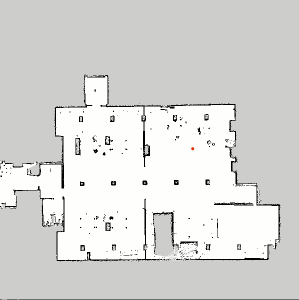
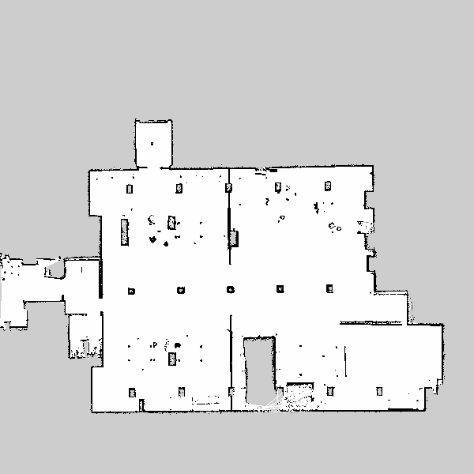
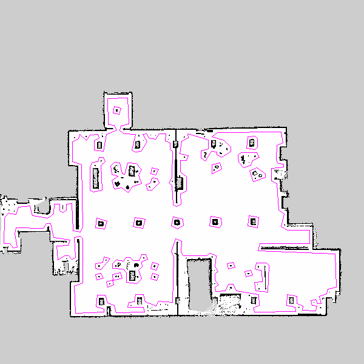
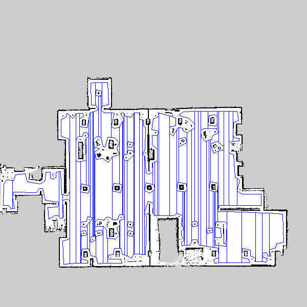
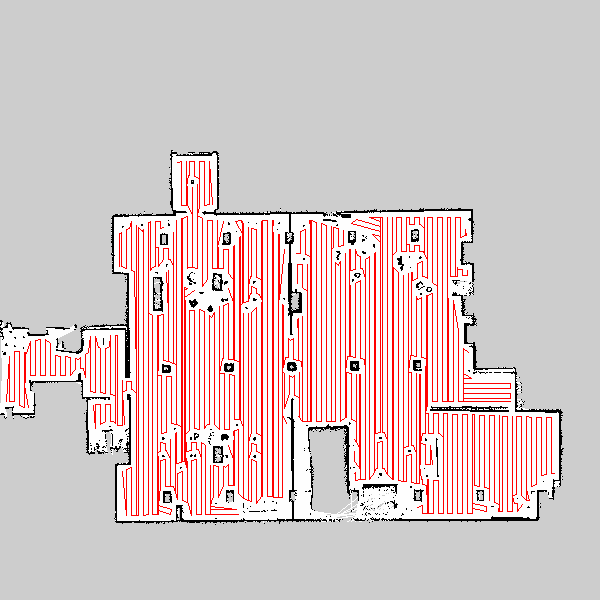

# CoveragePlanner

**Dependencies：**

CGAL 5.0

OpenCV 4.0

Eigen 3.0

**demo:**

**original pgm map:**

**acquire polygon boundary and obstacles:**

**boustrophedon cellular decomposition:**

**path planning by solving TSP:**

